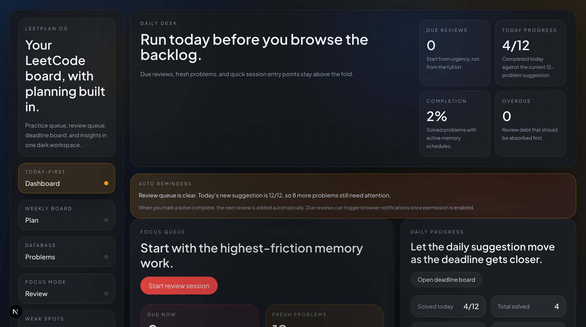

# leetcode-tracker

`leetcode-tracker` is a Next.js study workspace for interview prep. It combines a daily dashboard, deadline-based planning, spaced review, and a searchable LeetCode problem library in one interface.

## Preview



## Features

- Daily dashboard with due reviews, today's progress, and completion metrics
- Deadline-driven planning board that rebalances unsolved problems across the remaining days
- Problem database with status, difficulty, topic filters, and quick actions
- Spaced-review flow with `Again`, `Hard`, `Good`, `Easy`, and snooze actions
- Insights view for topic pressure, review load, and near-term schedule
- Local persistence through JSON files, with no database required

## Routes

- `/` - dashboard
- `/plan` - planning board
- `/problems` - problem database
- `/review` - review inbox and active review session
- `/insights` - study analytics

## Tech Stack

- Next.js 16
- React 19
- TypeScript
- Tailwind CSS 4
- Vitest

## Project Structure

```text
.
├── app/
├── components/
├── data/
├── docs/screenshots/
├── lib/
└── tests/
```

## Local Data

- `data/problems.ts` contains the built-in problem set
- `data/progress.json` stores progress, review intervals, notes, and session history
- `data/settings.json` stores the plan deadline and review settings

The app currently runs as a local-first, single-user project.

## Getting Started

Install dependencies:

```bash
npm install
```

Run the development server:

```bash
npm run dev
```

Open [http://localhost:3000](http://localhost:3000).

## Scripts

```bash
npm run dev
npm run build
npm run start
npm run lint
npm run test
```

## Notes

- The main app shell is driven by `components/study-workspace.tsx`
- Core planning and review logic lives in `lib/study.ts`
- API routes in `app/api/*` read and write the local JSON data files
